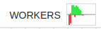

Concepts
########

Note
*****

Note is the formal name given to the unit of data that flows through a Graphbook workflow. A Note simply holds a dictionary which encapsulates certain information about the thing that is being processed. For example, we can have Notes for all of the world's cars where each Note stores a car’s model, manufacturer, price, and an array of images of the car. 

Step
*****

Step is the one of the two fundamental node types in Graphbook and is a class meant to be extended in Python. Steps are the functional nodes that define the logic of our data processing pipeline. They are fed Notes as input and respond with 0 or more Notes (or an array of notes) at each of its output slots.

Resource
********

Resource is the second fundamental node type in Graphbook and is also an extendible class. It simply holds static information, or is a Python object, that is fed as a parameter to another Resource or Step. A prime example of a Resource is a model. Tip: If a larger object such as a model is being used in multiple Steps in your workflow, it is best to reuse them by putting them in Resources and use the model as a parameter.

Step Lifecycle
**************

A Step goes through lifecycle methods upon processing a Note. The below methods are open for extension and are subject to change in future versions of Graphbook.

#. ``__init__``: The constructor of the Step. This is where you can set up the Step and its parameters. This will not be re-called if a node's code or its parameter values have not changed.
#. ``on_clear``: Called when the step is cleared. This is where you can delete any state that the Step has stored.
#. ``on_start``: This is called at the start of each graph execution.
#. ``on_before_items``: This is called before the Step processes each Note.
#. ``on_item``: This is called for each item.
#. ``on_item_batch``: This is called for each batch of items. *This only gets called if the Step is a BatchStep.*
#. ``on_after_items``: This is called after the Step processes each Note.
#. ``forward_note``: This is called after the Step processes each Note and is used to route the Note to a certain output slot.
#. ``on_end``: This is called at the end of each graph execution.

Workers
********

In order to maximize the utilization of the GPU during graph execution, we parallelize the preparation of inputs and outputs
for each BatchStep (an extension of Step) across a number of workers.
A BatchStep can require inputs to be prepared and outputs to be saved by workers.
Each worker is a separate process that can run in parallel with others.
A worker is dedicated to either preparing inputs or saving outputs, but not both. Whether it is preparing inputs or saving outputs, the worker logic
is relatively the same.
The Graphbook worker implementation also accounts for graph changes.
In between graph executions, the workers are restarted to register any code changes, and the queues along with its elements are retained and given to the new workers.

Logic Details
=============

.. image:: _static/concepts/graphbookworkersgraph.svg
    :alt: Example Graph
    :align: center

The above graph is used to explain the worker logic.

.. image:: _static/concepts/graphbookworkers.svg
    :alt: Graphbook Worker Concepts Illustration
    :align: center

The logic behind the workers is detailed in the following steps (1-6):

#.
    A BatchStep prepares the item's parameter inputs.
    The actual function, implemented by the BatchStep, is stored inside of a shared dictionary that the workers can access later.
#.
    A BatchStep enqueues the item in one of the load and dump queues, so that the workers can access them. The item is stored in its respective queue based on the ``id()`` of the BatchStep.
#.
    The workers will then dequeue the work from their work queues and execute the corresponding BatchStep's function (``load_fn()`` and ``dump_fn()``) on the item if the BatchStep still exists, but before they do that, they need to check the size of the result queue.
    If the result queue is full, the worker will block until space is available. The workers will rotate between queues in a round-robin fashion.
#.
    After the worker has finished processing the item, it will enqueue the result in its respective result queue.
#.
    The consumer nodes will then dequeue the results from their consumer queues and process them in their correct lifecycle method.
    Completed load items will be delivered to ``on_item_batch(results: List[any], items: List[any], notes: List[Note])`` where results, items, and notes are in order; i.e. ``results[i]`` corresponds to input ``items[i]`` and belonging to note ``notes[i]``.
    The size of the results, items, and notes lists will be equal to the batch size (or less if the batch size is not met).
    Completed dumped items will not be delivered to any lifecycle method.
    However, the BatchStep will still search for completed dumped items and keep track of which Note they belong to.
    If all dumped items from a Note are completed, then the Note is considered finished and can be delivered to the next Step for processing.
    We do this because if a following Step depends on the saving of a particular item from that Note, then that Step will execute too soon.

Worker Performance Visualization
=================================================

Sometimes, we do not know exactly how many workers will be needed. For this reason, Graphbook will offer an auto-scaling feature that will automatically adjust the number of workers based on the workload. 
For now, Graphbook offers a visualization about the performance of the workers that can indicate to the user when there are too many or too few workers, so that they can manually adjust the number of workers that they need.
See example below:

The visualization is in the form of a centered bar chart that shows the number of items that are enqueued in the work queues as red bars and the number of items that are in the result and consumer queues as green bars.
Because the result queue has a max size of 32, each half of the chart is clipped at 32 to show a relative comparison between the two queue types.
Refer to the following when reading this chart:

#. If the red bars are consistently longer than the green bars and there's hardly any green, it indicates that there are too few workers.
#. If the red bars are consistently longer than the green bars but there is some green, then it indicates that the graph execution on the main process is just too slow to consume all of the results which, in turn, creates a conjestion in the workers work queues. This is because the result queues have a max size, and if they are full, the workers will be blocked until space is available while the work queues are being loaded. A max size per result queue is enforced to help prevent memory overloading issues.
#. If the green bars are consistently longer than the red bars, it indicates there may be enough or too many workers dependending on your system constraints.
#. If there are no visible bars, it indicates that the workers are not being utilized.
