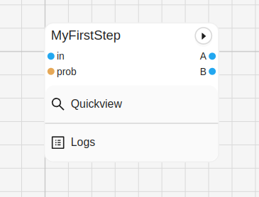
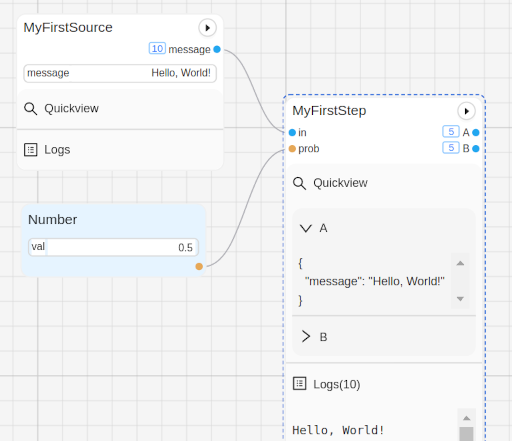
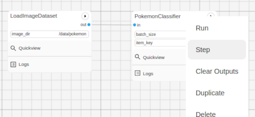
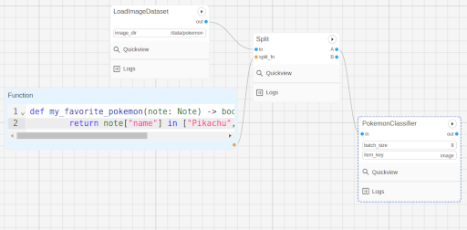
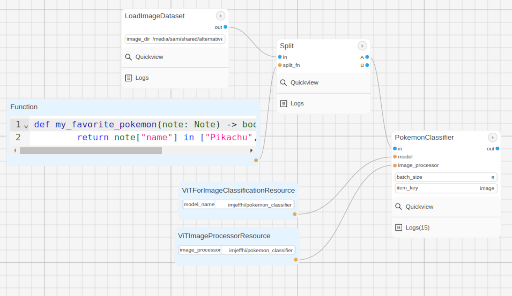
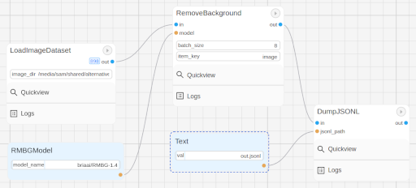

Guides
###########

All of the guides in this section are meant to help you get started with building ML workflows in Graphbook.
The resulting workflows and custom nodes can be found in :ref:`examples`.

Keep in mind that when working with Graphbook, the development cycle in building a workflow can be illustrated in a few simple steps:

#. **Build in Python**

    Write processing nodes using Python in your favorite code editor

#. **Assemble in Graphbook**

    Assemble an ML workflow in our graph-based editor with your own processing nodes

#. **Execute**

    Run, monitor, and adjust parameters in your workflow

Build Your First ML Workflow
=============================

All of your custom nodes should be located inside a directory that was automatically created for you upon running ``graphbook``.
Graphbook is tracking that directory for any files ending with **.py** and will automatically load classes that inherit from `Step` or `Resource` as custom nodes.
Inside this directory, create a new Python file called `my_first_nodes.py`, and create the below step inside of it:

.. code-block:: python

    from graphbook.steps import Step
    from graphbook import Note
    import random

    class MyFirstStep(Step):
        RequiresInput = True
        Parameters = {
            "prob": {
                "type": "resource"
            }
        }
        Outputs = ["A", "B"]
        Category = "Custom"
        def __init__(self, id, logger, prob):
            super().__init__(id, logger)
            self.prob = prob

        def on_after_items(self, note: Note):
            self.logger.log(note['message'])

        def forward_note(self, note: Note) -> str:
            if random.random() < self.prob:
                return "A"
            return "B"

Go into the Graphbook UI, create a new workflow by adding a new .json file.
Then, right click the pane, and add a new Step node and select `MyFirstStep` from the dropdown (Add Step > Custom > MyFirstStep).
See how your inputs and outputs are automatically populated.

Try running the graph.
Notice how you get an error.
That's because you have no inputs and you haven't configured `prob`.
Let's create a Source Step that generates fake data.

.. code-block:: python

    from graphbook.steps import SourceStep

    class MyFirstSource(SourceStep):
        RequiresInput = False
        Parameters = {
            "message": {
                "type": "string",
                "default": "Hello, World!"
            }
        }
        Outputs = ["message"]
        Category = "Custom"
        def __init__(self, id, logger, message):
            super().__init__(id, logger)
            self.message = message

        def load(self):
            return {
                "message": [Note({"message": self.message}) for _ in range(10)]
            }

        def forward_note(self, note: Note) -> str:
            return "message"

Add the new node to your workflow.
Connect the output slot "message" from `MyFirstSource` to the input slot "in" on `MyFirstStep`.
Then, add a NumberResource to your workflow (Add Resource > Util > Number).
Inside of the value widget enter a number between 0 and 1 (e.g. 0.5).
Now run it again, observe the logs, and observe the outputs.

Voila! You have successfully created your first workflow, but there's not much ML in this one. Follow the next guide to learn how to use a real ML model in your workflow.

Pokemon Image Classification
=============================

.. _transformers: https://huggingface.co/docs/transformers

.. note::
    Requires Huggingface transformers_

In this guide, we will use a pre-trained PyTorch model to classify Pokemon images.
First, we need to choose where we get our source of Pokemon images from.
Here's a good source: https://www.kaggle.com/datasets/hlrhegemony/pokemon-image-dataset.

Download and extract the dataset into any folder in your filesystem.
Just remember the path that it's in.
In this guide, the path that the dataset is in is `/data/pokemon`.

Create a new Source Step that loads the images and their labels:

.. code-block:: python

    from graphbook.steps import SourceStep
    from graphbook import Note
    import os
    import os.path as osp

    class LoadImageDataset(SourceStep):
        RequiresInput = False
        Outputs = ["out"]
        Category = "Custom"
        Parameters = {
            "image_dir": {
                "type": "string",
                "default": "<path to your pokemon image dataset>"
            }
        }

        def __init__(self, id, logger, image_dir: str):
            super().__init__(id, logger)
            self.image_dir = image_dir

        def load(self):
            subdirs = os.listdir(self.image_dir)

            def create_note(subdir):
                image_dir = osp.join(self.image_dir, subdir)
                return Note(
                    {
                        "name": subdir,
                        "image": [
                            {"value": osp.join(image_dir, img), "type": "image"}
                            for img in os.listdir(image_dir)
                        ],
                    }
                )

            return {"out": [create_note(subdir) for subdir in subdirs]}

Make sure to change the default image path to where you extracted the Pokemon image dataset.
The above node will load all the images from the dataset and output them as a list of notes containing the Pokemon's name and a list of images.
Notice how each image is structured.
It contains a ``value`` and a ``type``.
This is important for the UI to know how to fetch and render the image.
Now, let's find an off-the-shelf pre-trained pokemon classifier from Huggingface.
We can use the one with the id ``imjeffhi/pokemon_classifier``.
Let's create the below BatchStep class that uses this model to classify the images:

.. code-block:: python

    from graphbook.steps import BatchStep
    from transformers import ViTForImageClassification, ViTImageProcessor
    import torch
    import torchvision.transforms.functional as F
    from PIL import Image
    from typing import List

    class PokemonClassifier(BatchStep):
        RequiresInput = True
        Parameters = {
            "batch_size": {"type": "number", "default": 8},
            "item_key": {"type": "string", "default": "image"}
        }
        Outputs = ["out"]
        Category = "Custom"

        def __init__(
            self,
            id,
            logger,
            batch_size,
            item_key
        ):
            super().__init__(id, logger, batch_size, item_key)
            model_name = "imjeffhi/pokemon_classifier"
            self.model = ViTForImageClassification.from_pretrained(model_name)
            self.model = self.model.to('cuda') # If you do not have an Nvidia GPU, you can remove this line
            self.image_processor = ViTImageProcessor.from_pretrained(model_name)
            self.tp = 0
            self.num_samples = 0

        @staticmethod
        def load_fn(item: dict) -> torch.Tensor:
            im = Image.open(item["value"])
            image = F.to_tensor(im)
            if image.shape[0] == 1:
                image = image.repeat(3, 1, 1)
            elif image.shape[0] == 4:
                image = image[:3]
            return image

        @torch.no_grad()
        def on_item_batch(
            self, tensors: List[torch.Tensor], items: List[dict], notes: List[Note]
        ):
            extracted = self.image_processor(
                images=tensors, do_rescale=False, return_tensors="pt"
            )
            extracted = extracted.to("cuda") # Remove this if you do not have an Nvidia GPU
            predicted_id = self.model(**extracted).logits.argmax(-1)
            for t, item, note in zip(predicted_id, items, notes):
                item["prediction"] = self.model.config.id2label[t.item()]
                self.logger.log(f"Predicted {item['value']} as {item['prediction']}")
                if item["prediction"] == note["name"]:
                    self.tp += 1
                self.num_samples += 1
            if self.num_samples > 0:
                self.logger.log(f"Accuracy: {self.tp/self.num_samples:.2f}")

.. _PyTorch: https://pytorch.org/

The above node will classify the images using the pre-trained model and output the predictions while also calculating its own accuracy given the labels on the images.
It also specifies how the workers should load the images from disk onto Pytorch Tensors with the custom ``load_fn`` method which must return a PyTorch_ Tensor.
Also, notice how the PokemonClassifier has a parameter called ``item_key``.
This tells the BatchStep parent class what key should be batched upon receiving Notes.

.. warning::

    It is recommended to place each Step in its own file because when a .py is saved, it reloads all of the Step classes in that file, clearing any active outputs that could have belonged to a Step.
    But for the sake of simplicity, we have placed all of the steps in one file for this guide.

Now, go into the web UI and create a new workflow.
Add the LoadImageDataset and PokemonClassifer nodes, connect them, and step through the PokemonClassifer like so:

When we clicked on "Step" in the dialogue menu, it didn't execute through the entire dataset.
Instead, it ran a single batch of images taken from the dataset.
This is useful for debugging and testing.

In addition to limiting the number of images processed at a time, we can also filter what is fed into our PokemonClassifer node.
We can do that by filtering the pokemon by their name.
Add a node called Split (Add Step > Filtering > Split).
The node accepts a **FunctionResource** as a parameter.
Add a new Function (Add Resource > Util > Function) and write the following code inside of it:

.. code-block:: python

    def my_favorite_pokemon(note: Note) -> bool:
        return note["name"] in ["Pikachu", "Charmander", "Bulbasaur"]

Now, connect the nodes together like so:

Now, when you run the workflow, you can observe that the classification only happens for Pikachu, Charmander, and Bulbasaur.

Last but not least, let's create two resource nodes that will store the model and image processor and feed it to the PokemonClassifier step.
This is important because models are heavy and we don't want to load them every time that we add a new PokemonClassifer to our workflow.
Note that the way we did it is fine for now since we're just using one of those pokemon classifier models, but normally, it is good practice to separate the model and it's execution.
The top of your PokemonClassifier node should look like this:

.. code-block:: python

    class PokemonClassifier(BatchStep):
        RequiresInput = True
        Parameters = {
            "batch_size": {"type": "number", "default": 8},
            "item_key": {"type": "string", "default": "image"},
            "model": {
                "type": "resource",
            },
            "image_processor": {
                "type": "resource",
            },
        }
        Outputs = ["out"]
        Category = "Custom"

        def __init__(
            self,
            id,
            logger,
            batch_size,
            item_key,
            model: ViTForImageClassification,
            image_processor: ViTImageProcessor,
        ):
            super().__init__(id, logger, batch_size, item_key)
            self.model = model
            self.image_processor = image_processor
            self.tp = 0
            self.num_samples = 0

    ...

Also, create two Resource classes to store the model and image processor.

.. code-block:: python

    class ViTForImageClassificationResource(Resource):
        Category = "Huggingface/Transformers"
        Parameters = {
            "model_name": {
                "type": "string",
                "description": "The name of the model to load."
            }
        }
        def __init__(self, model_name: str):
            self.model = ViTForImageClassification.from_pretrained(model_name)
            self.model = self.model.to('cuda')
            super().__init__(self.model)

        def value(self):
            return self.model

    class ViTImageProcessorResource(Resource):
        Category = "Huggingface/Transformers"
        Parameters = {
            "image_processor": {
                "type": "string",
                "description": "The name of the image processor."
            }
        }
        def __init__(self, image_processor: str):
            self.image_processor = ViTImageProcessor.from_pretrained(image_processor)
            super().__init__(self.image_processor)

        def value(self):
            return self.image_processor

Again, the reason we did this is because if we wanted to instantiate multiple PokemonClassifier steps, we can reuse the large models without consuming more of our memory.

Now, your final workflow should look like this:

Congratulations! You have successfully created a Pokemon image classifier workflow using a pre-trained model from Huggingface.
What if we need to use a model to generate outputs and supply our Notes with those outputs?
Follow the next guide to learn how.

Image Segmentation
==================

In this guide, we will use a pre-trained model, RMBG-1.4, from Bria AI downloadable from Huggingface to remove the background from images.
We can use the same dataset from the Pokemon Image Classification guide, so let's reuse the LoadImageDataset source step.

First, let's create a new Resource class that will store the RMBG-1.4 model:

.. code-block:: python

    from graphbook.resources import Resource
    from transformers import AutoModelForImageSegmentation

    class RMBGModel(Resource):
        Category = "Custom"
        Parameters = {
            "model_name": {
                "type": "string",
                "description": "The name of the image processor.",
            }
        }

        def __init__(self, model_name: str):
            super().__init__(
                AutoModelForImageSegmentation.from_pretrained(
                    model_name, trust_remote_code=True
                ).to("cuda")
            )

Then, create a new BatchStep class that uses the RMBG-1.4 model to remove the background from the images:

.. code-block:: python

    from graphbook.steps import BatchStep, SourceStep
    from graphbook import Note
    import torchvision.transforms.functional as F
    import torch.nn.functional
    import torch
    from typing import List
    from PIL import Image
    import os
    import os.path as osp

    class RemoveBackground(BatchStep):
        RequiresInput = True
        Parameters = {
            "model": {
                "type": "resource",
            },
            "batch_size": {
                "type": "number",
                "default": 8,
            },
            "item_key": {
                "type": "string",
                "default": "image",
            },
            "output_dir": {
                "type": "string",
            },
        }
        Outputs = ["out"]
        Category = "Custom"

        def __init__(
            self,
            id,
            logger,
            batch_size,
            item_key,
            output_dir,
            model: AutoModelForImageSegmentation,
        ):
            super().__init__(id, logger, batch_size, item_key)
            self.model = model
            self.output_dir = output_dir
            os.makedirs(output_dir, exist_ok=True)

        @staticmethod
        def load_fn(item: dict) -> torch.Tensor:
            im = Image.open(item["value"])
            image = F.to_tensor(im)
            if image.shape[0] == 1:
                image = image.repeat(3, 1, 1)
            elif image.shape[0] == 4:
                image = image[:3]

            return image

        @staticmethod
        def dump_fn(data: Tuple[torch.Tensor, str]):
            t, output_path = data
            dir = osp.dirname(output_path)
            os.makedirs(dir, exist_ok=True)
            img = F.to_pil_image(t)
            img.save(output_path)

        def get_output_path(self, note, input_path):
            return osp.join(self.output_dir, note["name"], osp.basename(input_path))

        @torch.no_grad()
        def on_item_batch(
            self, tensors: List[torch.Tensor], items: List[dict], notes: List[Note]
        ):
            og_sizes = [t.shape[1:] for t in tensors]

            images = [
                F.normalize(
                    torch.nn.functional.interpolate(
                        torch.unsqueeze(image, 0), size=[1024, 1024], mode="bilinear"
                    ),
                    [0.5, 0.5, 0.5],
                    [1.0, 1.0, 1.0],
                )
                for image in tensors
            ]
            images = torch.stack(images).to("cuda")
            images = torch.squeeze(images, 1)
            tup = self.model(images)
            result = tup[0][0]
            ma = torch.max(result)
            mi = torch.min(result)
            result = (result - mi) / (ma - mi)
            resized = [
                torch.squeeze(
                    torch.nn.functional.interpolate(
                        torch.unsqueeze(image, 0), size=og_size, mode="bilinear"
                    ),
                    0,
                ).cpu()
                for image, og_size in zip(result, og_sizes)
            ]
            paths = [
                self.get_output_path(note, input["value"])
                for input, note in zip(items, notes)
            ]
            removed_bg = list(zip(resized, paths))
            for path, note in zip(paths, notes):
                masks = note["masks"]
                if masks is None:
                    masks = []
                masks.append({"value": path, "type": "image"})
                note["masks"] = masks

            return removed_bg

This node will generate masks of the foreground using the RMBG-1.4 model and output the resulting mask as images by saving them to disk.
See that there is one notable difference in RemoveBackground compared to PokemonClassifier.
In addition to loading data from disk, it is now dumping data to the disk, the model outputs. 
It is important that we offload this work, too, to background processes to have an efficient data pipeline.
To do this, we return a dictionary of tensors in the ``on_item_batch`` method which tells Graphbook to send the resulting items to the worker processes to be saved.
Each element inside ``removed_bg`` is sent to the ``dump_fn`` method which executes our saving under one of the worker processes.
The ``dump_fn`` method is our custom function used to save the resulting image masks to disk.

Lastly, connect your nodes like so:

Make sure to specify the output directory in the RemoveBackground node, and where your image dataset is inside the LoadImageDataset node.
Note that we use another built-in node called DumpJSONL that saves the resulting output Notes as serialized JSON lines to a file.
This is useful for us to check on our outputs later on.

If you remember that game "Who's that Pokemon?" from the Pokemon TV show, you can now play it with your friends using these generated masks!

.. note::

    More guides are coming soon!
