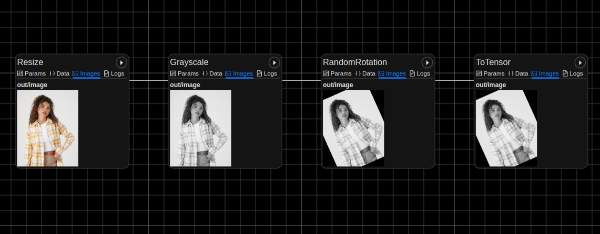

.. meta::
    :description: Learn how to log your images and visualize your image pipelines with Graphbook.
    :twitter:description: Learn how to log your images and visualize your image pipelines with Graphbook.

.. _Transforms: https://pytorch.org/vision/stable/transforms.html

.. _repo: https://github.com/graphbookai/graphbook

.. _Logging_Learn:

Log Your Image Pipelines
########################

.. rst-class:: lead

    Log your images and visualize your image pipelines with Graphbook!

.. warning::
    This feature is currently in beta. Please report any issues to the repo_.

Graphbook allows you to log images and monitor your image pipeline outputs.
Compatible with the `torchvision.transforms <https://pytorch.org/vision/stable/transforms.html>`_ library, Graphbook will log each transform output.
This is useful for debugging and visualizing your data augmentations during vision-based training with PyTorch.

**Important:** This feature should not be confused with the logging feature that exists for *Graphbook Pipelines*.
See :meth:`graphbook.steps.Step.log` if you want to log textual information associated with specific nodes in your Graphbook Pipelines.

Torchvision Transforms
======================

To log torchvision transforms, you can use :class:`graphbook.logger.TransformsLogger`.
By passing your ``transforms.Compose`` object into the logger, you can log the images at each step of the transform and view them in Graphbook.

.. code-block:: python
    :caption: transforms.py
    :emphasize-added: 1,14,15

    from graphbook.logger import TransformsLogger
    import torchvision.transforms as transforms
    from PIL import Image

    # Define your transforms
    transform = transforms.Compose([
        transforms.Resize(256),
        transforms.Grayscale(),
        transforms.RandomRotation(45),
        transforms.ToTensor(),
    ])

    # Log your transforms
    logger = TransformsLogger(name="my_transforms")
    transform = logger.log(transform)

    # Process an image
    img = Image.open("path/to/image.jpg")
    img = transform(img)

The above should create a file ``logs/my_transforms.log`` from your current working directory.
To view your image logs, start graphbook (simply by running ``graphbook`` in your terminal) and navigate to http://localhost:8005 in your browser.

This will open the Graphbook UI in your browser, where you can view your image logs.
You should see ``my_transforms.log`` underneath **Executions** on the bottom left. Click on it to view the images:

Writing logs is multiprocess-safe, so you can use `torch.utils.data.DataLoader <https://pytorch.org/docs/stable/data.html#multi-process-data-loading>`_ with multiple workers.
Example:

.. code-block:: python
    :caption: train.py
    :emphasize-added: 1,15,16

    from graphbook.logger import TransformsLogger
    import torchvision.transforms as transforms
    from torch.utils.data import DataLoader
    from PIL import Image

    # Define your transforms
    transform = transforms.Compose([
        transforms.Resize(256),
        transforms.Grayscale(),
        transforms.RandomRotation(45),
        transforms.ToTensor(),
    ])

    # Save disk space by logging every 10th image for each transform
    logger = TransformsLogger(name="my_dataset_transforms", log_every=10) 
    transform = logger.log(transform)

    # Process an image
    dataset = YourCustomDataset(transform=transform)
    dataloader = DataLoader(dataset, batch_size=4, shuffle=True, num_workers=4)

    for batch in dataloader:
        # Your training step here ...

.. tip::
    
    We are currently working on adding support for other libraries, so stay tuned!

Low-Level API
=============

If you want to have full control of the logging capabilities that Graphbook provides, you can use the :class:`graphbook.logger.DAGLogger` class.
Setting up the graph and logging the images requires manual setup of the nodes and references, but allows for more flexibility.
Below is an example of usage:

.. code-block:: python
    :caption: myapp.py

    import graphbook as gb
    from PIL import Image
    from torchvision import transforms as T

    l = gb.DAGLogger("example")

    def load_image(img_path):
        img = Image.open(img_path)
        return T.ToTensor()(img)

    def crop(img, crop_size):
        return T.CenterCrop(crop_size)(img)

    def gray_scale(img):
        return T.Grayscale()(img)

    def flip(img):
        return T.RandomHorizontalFlip(p=1)(img)

    img_path = "/media/sam/shared/orientation/000011.jpg"
    img = load_image(img_path)
    ref = l.node("load_image", "loads an image")
    ref.log(img)

    img = crop(img, 600)
    ref = l.node("crop", "crops the image", ref)
    ref.log(img)

    gray_scale_ref = l.node("gray_scale", "converts the image to grayscale", ref)
    gray_scale_ref.log(gray_scale(img))

    flip_ref = l.node("flip", "horizontally flips the image", ref)
    flip_ref.log(flip(img))
