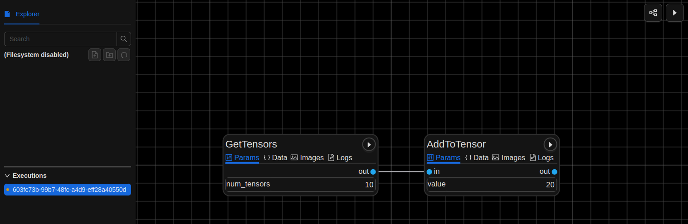

.. meta::
    :description: Learn how to make scalable AI/ML applications with node parameters, monitoring, and performance visualizations using Ray DAGs and Graphbook.
    :twitter:description: Learn how to make scalable AI/ML applications with node parameters, monitoring, and performance visualizations using Ray DAGs and Graphbook.

.. _Ray: https://github.com/ray-project/ray

.. _repo: https://github.com/graphbookai/graphbook

.. _Ray_Learn:

Ray and All-Code DAGs
######################

.. rst-class:: lead

    Build distributable Ray Apps with Graphbook!

.. warning::
    This feature is currently in beta. Please report any issues to the repo_.

Ray_ is a distributed computing framework that allows you to scale your workflows across multiple machines.
You can build Ray DAGs in Python code using Graphbook's API which provides a wrapper around each node, so that your applications can have the following capabilities:

* **Node Parameters**: Define parameters for each node and configure them in the UI
* **Multi-Output Nodes**: All nodes have named output bindings that can be individually connected to by other nodes
* **Node Documentation**: Docustring from each node class is displayed in the UI
* **Monitoring**: Monitor logging and performance of each node in the UI
* **Output Visualizations**: Visualize the structured Note outputs and images coming from each node.

Although using Ray can make your applications more scalable, there are some limitations to be aware of. See :ref:`Ray_Limitations`.

Source Steps
============

You can build Source Steps the same way as normal without generators.
The following should be a familiar example. We will create a source node that generates random tensors.

.. code-block:: python
    :caption: myapp.py
    :emphasize-added: 5,7

    import graphbook as gb
    from graphbook.steps import Step, SourceStep
    import torch

    gb.init()

    @gb.remote
    class GetTensors(SourceStep):
        """
        A source step that generates random tensors.
        """
        Parameters = {
            "num_tensors": {
                "type": "number",
                "default": 10
            },
        }
        Outputs = ["out"]

        def __init__(self, num_tensors):
            super().__init__()
            self.num_tensors = num_tensors

        def load(self):
            tensors = [torch.rand(3, 3) for _ in range(self.num_tensors)]
            return {
                "out": [gb.Note({"tensor": t}) for t in tensors]
            }

Notice how the class is exactly the same as a normal Graphbook Source Step, but with the :func:`graphbook.remote` decorator.
This decorator converts your class to a `Ray Actors <https://docs.ray.io/en/latest/ray-core/actors.html>`_ that is compatible with Graphbook.
All other node types can be used in Ray DAGs as well except for the ones listed in :ref:`Ray_Limitations`.

Additionally, we call :func:`graphbook.init()` to initialize the Graphbook Ray backend and start the Graphbook UI which can be located at https://localhost:8005.
But wait, we don't have a full DAG yet, so continue reading to see full working examples.

Assemble the DAG
================

To assemble the DAG, you can add the following code to ``myapp.py``:

.. code-block:: python
    :caption: myapp.py

    ...

    @gb.remote
    class AddToTensor(Step):
        """
        A step that simply adds a fixed value to incoming tensors.
        """
        Parameters = {
            "value": {
                "type": "number",
                "default": 20
            }
        }
        Outputs = ["out"]

        def __init__(self, value):
            super().__init__()
            self.value = value

        def on_data(self, data: dict):
            data["tensor"] += self.value
            gb.log(f'New value: {data["tensor"]}') # You may log as normal

    # Initialize the nodes
    tensors = GetTensors.remote()
    add = AddToTensor.remote()

    # Connect the nodes
    out_ref = add.bind("out", tensors)

    # Run the DAG
    out = gb.run(out_ref)
    print(out)

Again, we've added the ``remote`` decorator to the ``AddToTensor`` class.
And to construct the DAG, we use the ``remote`` method on the source node to create a reference to the remote `Actor <https://docs.ray.io/en/latest/ray-core/actors.html>`_.
Then, we use the ``bind`` method to connect the nodes together, and finally, we run the DAG with ``gb.run``.

Notice the critical difference between Graphbook and Ray DAGs: the ``bind`` method requires the output name and the node reference.
It is important to include the output name or else simply passing the node reference will be ambiguous since all Steps are multi-output.
Additionally, we do not call ``bind`` on an specific Actor method, but rather on the Actor object itself.
You must use this ``bind`` method because Graphbook nodes have a lifecycle which is typically implemented in their own respective ``__call__`` method,
and they have inputs and outputs to be handled by a separate Actor which works to provide configuration and monitoring of each node.

Also, to provide multiple inputs to a Step, see the following example:

.. code-block:: python
    :caption: myapp.py

    ...

    # Initialize the nodes
    tensors1 = GetTensors.remote()
    tensors2 = GetTensors.remote()
    add = AddToTensor.remote()

    # Connect the nodes
    out_ref = add.bind("out", tensors1, "out", tensors2)

    # Run the DAG
    out = gb.run(out_ref) # Hangs until a user clicks "Play" in the UI
    print(out)

As you can see, the ``bind`` method must take an even number of parameters, where each pair is the output name and the node reference, in that order.

Go ahead and run the DAG with ``python myapp.py``.
You should begin to see that a name for your execution is generated, and Graphbook should invite you to configure the application in the UI.
You can change the parameters of the nodes and monitor the performance of each node in the UI, and once you're ready, you can click the play button on the top right.

Upon completion, you will see your output printed to the console.

To keep the web app running after execution is finished, you can add the following code to the end of your script:

.. code-block:: python
    :caption: myapp.py

    ...

    import time

    try:
        time.sleep(999999)
    except KeyboardInterrupt:
        pass

Resources
=========

Resource nodes are also supported by Graphbook's Ray API.
Create a resource node like so:

.. code-block:: python
    :caption: myapp.py

    ...

    from graphbook.resources import Resource

    @gb.remote
    class MyMessage(Resource):
        """
        A resource that holds a message.
        """

        Parameters = {
            "message": {
                "type": "string",
                "default": "Hello, World!"
            }
        }

        def __init__(self, message):
            super().__init__(message)

    message = MyMessage.remote()

Modify the ``GetTensors`` class to accept the resource as a parameter:

.. code-block:: python
    :caption: myapp.py
    :emphasize-added: 10,11,12,17,20,23
    :emphasize-removed: 16

    ...

    @gb.remote
    class GetTensors(SourceStep):
        Parameters = {
            "num_tensors": {
                "type": "number",
                "default": 10
            },     
            "message": {
                "type": "resource",
            },
        }
        Outputs = ["out"]

        def __init__(self, num_tensors):
        def __init__(self, num_tensors, message):
            super().__init__()
            self.num_tensors = num_tensors
            self.message = message

        def load(self):
            gb.log(self.message) # Prints "Hello, World!"
            tensors = [torch.rand(3, 3) for _ in range(self.num_tensors)]
            return {
                "out": [gb.Note({"tensor": t}) for t in tensors]
            }

Resources should be supplied to the remote construction of other nodes as a **keyword argument**, like so:

.. code-block:: python
    :caption: myapp.py

    tensors = GetTensors.remote(message=message)
    add = AddToTensor.remote()
    out_ref = add.bind("out", tensors)
    out = gb.run(out_ref)
    print(out)

.. _Ray_Limitations:

Current Limitations
===================

*
    Nodes created as functions are not yet supported. You must use classes for now.

*
    Execution is synchronous as opposed to the default asynchronous execution that is offered by Graphbook.
    This may slow down troubleshooting of problems that may happen deeper in the DAG.

*
    Only one DAG execution can be constructed at a time.

*
    Currently unsupported features with Ray DAGs, but will be supported in the near future:
    
    * **Prompting**: :class:`graphbook.steps.PromptStep` is not yet supported.

    * **Batching**: :class:`graphbook.steps.BatchStep` is not yet supported but can be easily implemented by the user since execution is synchronous. Feel free to parallelize loading and dumping I/O with regular `ray tasks <https://docs.ray.io/en/latest/ray-core/tasks.html>`_.
    
    * **Streaming/Generator Source Steps**: :class:`graphbook.steps.GeneratorSourceStep` is not yet supported due to the limitations of Ray DAGs. This means you cannot use generators to asynchronously yield data in source nodes when building Ray DAGs with Graphbook.
    
    * **Workflow Documentation**: is not yet supported. Node documentation is still supported.

